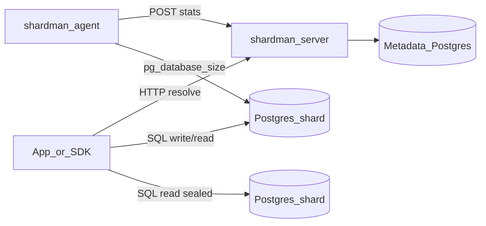
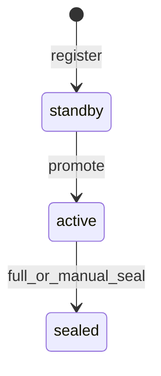

# Shardman Rust MVP

## Scope

Control plane **без** Postgres-proxy и **без** tenant-per-shard. Режим `range` + ось периода `time|numeric` задаются при bootstrap и **immutable**. Приложения сами ходят в Postgres-шарды; Shardman отвечает только «куда писать / откуда читать».

Заимствуем из [little-big-files](https://github.com/tormoz70/little-big-files) ([sharding-model.md](https://github.com/tormoz70/little-big-files/blob/main/docs/sharding-model.md)):

- lifecycle `standby → active → sealed`
- ровно один **active на period_id** (в LBF — один global active; у нас — один active **на период**)
- hot-add только как `standby` + `CLUSTER_KEY`
- seal-rotate в одной DB-транзакции (CAS)
- auto-promote reachable standby, если active нет
- `/metrics` Prometheus + docker-стенд с Grafana
- структура docs: `docs/sharding-model.md`, `architecture.md`, `.ai/master-spec.yaml`

Не берём из LBF: content-addressed storage, proxy write/read, global package index, replicas/sync.

## Architecture





**Write:** `shard_key → period_id → active shard endpoint`  
**Read:** `shard_key → period_id → sealed ∪ active` (fan-out на стороне приложения)

## Bootstrap invariants (immutable)

В таблице `cluster_config` ровно одна строка после bootstrap:

- `mode = range` (tenant-per-shard — не в MVP, поле на будущее)
- `period_axis = time | numeric`
- `period_spec` — JSON, например `{ "unit": "day" }` или `{ "width": 1000000 }`
- `shard_max_bytes` — порог seal
- смена axis/spec/mode после bootstrap — **запрещена** (API возвращает 409)

`period_id` — стабильная строка:

- time: UTC bucket, напр. `2026-08-06` для day
- numeric: `floor(key / width)` → `p{n}`

## Metadata schema (отдельный Postgres)

- `cluster_config` — immutable bootstrap
- `shards` — аналог LBF `shard_registry`:
  - `id`, `shard_uuid`, `period_id`, `state`, `dsn`/`advertise_url`, `reported_bytes`, `max_bytes`, `last_seen_at`, `sealed_at`, `version` (для CAS)
- уникальный partial index: **один `active` на `(period_id)`**
- `shard_events` — audit seal/promote (удобно для метрик/отладки)

Миграции: SQL-файлы + `sqlx migrate` при старте сервера.

## HTTP API (axum)

Публичные (resolve):

| Method | Path | Назначение |
|--------|------|------------|
| POST | `/v1/resolve/write` | `{ shard_key }` → active endpoint |
| POST | `/v1/resolve/read` | `{ shard_key }` → список sealed+active |
| GET | `/v1/periods/{period_id}/shards` | топология периода |
| GET | `/healthz` | liveness |
| GET | `/metrics` | Prometheus |

Admin / internal (`X-Cluster-Key`):

| Method | Path | Назначение |
|--------|------|------------|
| POST | `/v1/admin/bootstrap` | один раз: config |
| GET/POST | `/v1/admin/shards` | list / register (`startup_state=standby` only) |
| POST | `/v1/admin/seal-rotate` | body: `period_id` — seal active + promote next standby |
| PATCH | `/v1/admin/shards/{id}/state` | recovery transitions с валидацией FSM |
| POST | `/v1/internal/stats` | agent heartbeat: bytes, reachable |

Ошибки в духе LBF: нет active и нет standby → `503`; нарушение FSM/immutable config → `409`.

## Seal supervisor

Фоновый loop (интервал `SEAL_CHECK_INTERVAL`, как в LBF ~30s):

1. для каждого `period_id` с `active`
2. если `reported_bytes >= shard_max_bytes` (или shard-local max)
3. в транзакции: `active → sealed`, следующий `standby → active` (ORDER BY id)
4. если standby нет — метрика `shardman_standby_exhausted` + лог; writes продолжают идти в переполненный active (**fail-open с alert** для MVP)
5. если active отсутствует — auto-promote первого reachable standby

Достижимость: `last_seen_at` от agent в пределах TTL.

## shardman-agent (нужен для авто-seal)

Лёгкий бинарь рядом с каждым Postgres-шардом:

- читает `PG_DSN`, `SHARD_UUID`, `COORDINATOR_URL`, `CLUSTER_KEY`
- периодически: `pg_database_size(current_database())` (+ опционально tablespace)
- `POST /v1/internal/stats`
- без agent авто-seal не работает — остаётся ручной `seal-rotate` (тоже в MVP)

## Rust workspace

```
shardman/
  Cargo.toml
  crates/
    shardman-core/     # PeriodSpec, period_id(), StateMachine, types
    shardman-server/   # axum control plane + seal loop
    shardman-agent/    # stats reporter
    shardman-cli/      # bootstrap, shards list/add, seal-rotate
  migrations/
  deploy/              # docker-compose: metadata PG, server, 2 fake agents или test PG, Prometheus, Grafana
  docs/
  .ai/master-spec.yaml
```

Стек: **Rust 2021**, `tokio`, `axum`, `sqlx` (Postgres), `serde`, `uuid`, `clap`, `tracing` + `tracing-subscriber`, `metrics` + `metrics-exporter-prometheus`, `chrono`/`time`.

## Monitoring (обязательно в MVP)

Метрики (имена в стиле LBF):

- `shardman_http_requests_total` / latency histogram
- `shardman_shards{period_id,state}` — gauge count
- `shardman_shard_reported_bytes{shard_uuid,period_id,state}`
- `shardman_seal_total{period_id}`
- `shardman_promote_total{period_id}`
- `shardman_active_missing{period_id}`
- `shardman_standby_exhausted{period_id}`
- `shardman_agent_last_seen_seconds{shard_uuid}`

`deploy/`: Prometheus scrape `/metrics`, Grafana dashboard JSON (топология по state, seal rate, bytes to limit).

## Tests & acceptance

- unit: `period_id` для time/numeric; FSM transitions; CAS seal-rotate
- integration (testcontainers или compose PG): bootstrap → register 2 standby → promote → stats over max → seal → resolve write указывает на новый active; read возвращает оба
- smoke: `make docker-up` + cli resolve

## Docs (минимум)

- `docs/sharding-model.md` — range periods + lifecycle
- `docs/architecture.md` — control plane vs data plane
- `README.md` — quick start
- `.ai/master-spec.yaml` — SoT для агентов (как в LBF)

## Out of MVP

- tenant-per-shard mode
- SQL proxy / wire protocol
- смена period_spec, rebalance, cross-period tx
- schema migrations на data-шардах
- HA самого control plane (один инстанс + metadata PG достаточно)
- gRPC

## Implementation order

1. Workspace + `shardman-core` (period + FSM)
2. Migrations + server bootstrap/admin/resolve
3. Seal loop + stats endpoint
4. Agent + CLI
5. Prometheus/Grafana compose + integration tests
6. Docs / master-spec

## Git / GitHub

Все взаимодействия с GitHub — **только по SSH** (`git@github.com:...`), не HTTPS.

- remote: `git@github.com:<org>/shardman.git`
- перед `fetch` / `pull` / `push` / `gh`: SSH preflight (`ensure-github-ssh.ps1` из skill github-ssh)
- при `Permission denied (publickey)` — не переключаться на HTTPS; чинить SSH-agent / ключ
- `gh` использовать с SSH-контекстом репозитория
