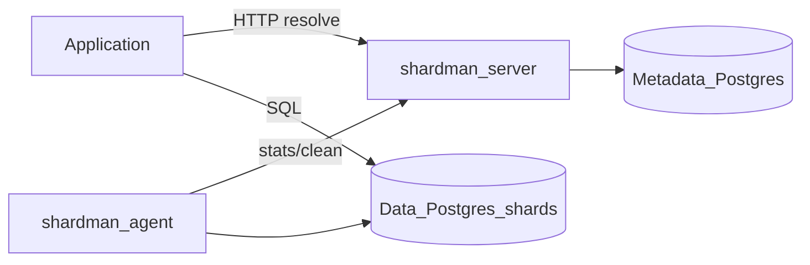

# Architecture

## Control plane vs data plane

Shardman does **not** proxy SQL. Applications:

1. `POST /v1/resolve/write` with `shard_key`
2. Connect to returned `endpoint` (Postgres DSN/URL)
3. Execute SQL

## Components

| Component | Package / binary | Responsibility |
|-----------|------------------|----------------|
| Server | `cmd/server` | HTTP API, metadata, seal + retention supervisors |
| Agent | `cmd/agent` | `pg_database_size` heartbeat, execute clean |
| CLI | `cmd/shardman` | Bootstrap, register, resolve, seal-rotate |
| Core | `internal/period`, `internal/fsm` | Period IDs, routing, state machine |
| Store | `internal/store` | Metadata persistence (pgx) |

## Supervisors

**Volume seal** (`internal/seal`): active data shard full → seal + promote standby for same period.

**Retention** (`internal/retention`, time only): evicted periods → mark `cleaning` → agent truncates → `standby`.

## Security

Admin and `/v1/internal/*` require `X-Cluster-Key` (constant-time compare). Without `CLUSTER_KEY`, internal routes return 503.

## Observability

Prometheus `/metrics` — HTTP, shard states, seal/promote, standby pool, error routes, retention clean.

Deploy profile: `deploy/docker-compose.yml` (metadata + server + Prometheus + Grafana).

## Reference

Lifecycle patterns borrowed from [little-big-files](https://github.com/tormoz70/little-big-files) (standby/active/sealed, hot-add, seal-rotate).
