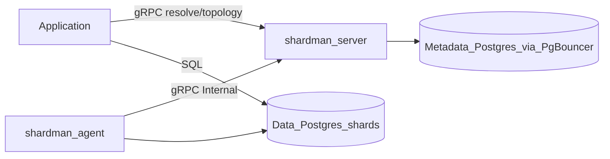

# Architecture

## Control plane vs data plane



Shardman does **not** proxy SQL. Applications:

1. `Topology.Get` / `Topology.Watch` — cache routes (recommended)
2. `Resolve.Write` / `Resolve.Read` with `shard_key` on cache miss
3. Connect to returned `endpoint` (Postgres DSN/URL)
4. Execute SQL

## Repository layout

```
api/proto/shardman/v1/   protobuf services
api/gen/                 generated Go stubs
cmd/{server,agent,shardman}
internal/{grpcapi,bucket,fsm,store,resolve,seal,retention,topology,metrics,oteltrace}
pkg/client               Go SDK
deploy/                  docker-compose, Prometheus, Tempo (tracing profile)
```

## Components

| Component | Package / binary | Responsibility |
|-----------|------------------|----------------|
| Server | `cmd/server` | gRPC API, metadata, seal + retention + health supervisors, ops HTTP |
| Agent | `cmd/agent` | Size heartbeat (`SIZE_SOURCE`), drain revoke/terminate, truncate on `cleaning` |
| CLI | `cmd/shardman` | Bootstrap, register, resolve, seal-rotate, topology |
| Client SDK | `pkg/client` | Topology cache + `Watch`, local resolve from cache, gRPC fallback, scatter helper |
| Core | `internal/bucket`, `internal/fsm` | Bucket IDs, routing, state machine |
| Store | `internal/store` | Metadata persistence (pgx), migrations, in-memory `ClusterConfig` cache |
| gRPC | `internal/grpcapi` | Service handlers |

## API

| Transport | Default | Endpoints |
|-----------|---------|-----------|
| gRPC | `GRPC_ADDR=:9090` (`:9091` in compose) | `Resolve`, `Topology`, `Admin`, `Internal` |
| HTTP ops | `HTTP_ADDR=:8080` | `GET /healthz`, `GET /metrics` only |

### gRPC services

| Service | Auth | RPCs |
|---------|------|------|
| `ResolveService` | public | `Write`, `Read`, `ListBucketShards` |
| `TopologyService` | public | `Get`, `Watch` (server stream) |
| `AdminService` | `x-cluster-key` | `Bootstrap`, `ListShards`, `RegisterShard`, `SealRotate`, `PatchShardState`, `RetentionTick` |
| `InternalService` | `x-cluster-key` | `ReportStats`, `ReportCleaned`, `ReportDrainComplete` |

### Status codes

| Condition | gRPC code |
|-----------|-----------|
| No active / standby exhausted | `Unavailable` |
| Second bootstrap | `AlreadyExists` |
| Bad/missing cluster key | `Unauthenticated` |
| Seal / state conflict | `Aborted` / `NotFound` |

## Supervisors

**Volume seal** (`internal/seal`):

```
active (full) → draining → agent drain → sealed → promote standby
```

If no standby: sealed without promote; writes return `Unavailable` until standbys registered.

**Retention** (`internal/retention`, time axis only):

```
evicted bucket: sealed shards → cleaning → agent truncate → standby
```

Skips buckets that still have `active` or `draining` shards.

**Heartbeat health** (`internal/health`):

```
stale data active (last_seen_at > HEARTBEAT_TIMEOUT) → auto SealRotate → fresh standby active
```

Stale actives are soft-excluded from resolve; error shard is never auto-rotated.

## Metadata HA

Production: metadata Postgres behind **PgBouncer** + external HA cluster. Shardman uses a single DSN; failover is an ops concern (no in-app reconnect logic).

## Resolve hot path

`cluster_config` is immutable after bootstrap. `internal/store` caches `ClusterConfig` in memory (`atomic.Value`); `Resolve.Write` / `Resolve.Read` read from cache, not metadata DB on every request.

## Topology consistency

Shard state changes and `topology_version` bumps run in the **same database transaction** (`RegisterShard`, promote, seal-rotate, drain seal, `PatchShardState`, retention clean). Clients invalidate route cache on `topology_version` change.

`PatchShardState` uses `SELECT … FOR UPDATE` + optimistic `version` check to prevent FSM TOCTOU races.

## Client routing contract

- Cache topology by `topology_version`.
- Resolve locally from cached topology when route + shard are present (`pkg/client`).
- gRPC fallback on cache miss (auto-promote, stale failover).
- Invalidate on version bump, gRPC `Unavailable`, or write to sealed shard.
- Do not call resolve on every SQL statement.

## Hash analytics

See [sharding-model.md](sharding-model.md#hash-mode-analytics). Scatter-gather is client responsibility; prefer OLAP for analytics.

## Observability

| Signal | Where |
|--------|-------|
| Prometheus metrics | `GET /metrics` on HTTP ops port |
| Resolve latency | `shardman_resolve_duration_seconds{op=write\|read}` |
| Active shards | `shardman_active_shards` |
| Seal / promote / standby pool | `shardman_seal_total`, `shardman_seal_duration_seconds`, `shardman_promote_total`, `shardman_standby_pool_size` |
| Topology / config cache | `shardman_topology_version`, `shardman_resolve_config_cache_hits_total`, `shardman_resolve_config_cache_misses_total` |
| Heartbeat failover | `shardman_heartbeat_failover_total`, `shardman_stale_active_shards` |
| Agent heartbeat | `shardman_agent_last_seen_seconds` |
| Error routing | `shardman_error_route_total`, `shardman_error_shard_bytes` |
| OTel traces | `OTEL_EXPORTER_OTLP_ENDPOINT` → OTLP (optional Tempo profile in compose) |

Alert runbook: [runbook-alerts.md](runbook-alerts.md). Example rules: [deploy/alerts.yaml](../deploy/alerts.yaml).

## Local stack (compose)

```bash
make docker-up
# gRPC localhost:9091, metrics localhost:8080, metadata localhost:5433
```

Tracing profile:

```bash
OTEL_EXPORTER_OTLP_ENDPOINT=tempo:4317 docker compose -f deploy/docker-compose.yml --profile tracing up
```

## Reference

Lifecycle patterns borrowed from [little-big-files](https://github.com/tormoz70/little-big-files).
