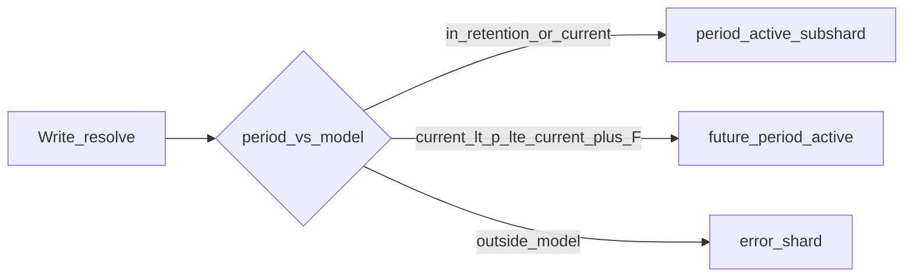
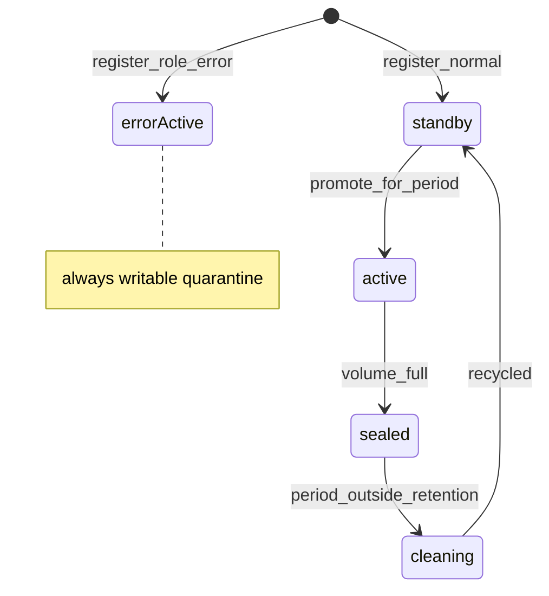

# Shardman Go MVP

> Overview: MVP control plane на Go для range-шардирования Postgres: metadata-БД, HTTP resolve, volume-subshards, time retention-кольцо, future periods (`max_future_periods`), error-шард, Prometheus.

**Стек:** Go 1.22+. SQL proxy — out of MVP.

## Todos

- [ ] Go module + `internal/period` + `internal/fsm` (subshard, retention, error role)
- [ ] Migrations + chi: bootstrap (`retention_depth`, `max_future_periods`, error shard), resolve, CLUSTER_KEY
- [ ] Volume seal + retention clean + error-shard routing
- [ ] `cmd/agent` + `cmd/shardman` CLI
- [ ] Prometheus + compose/Grafana + tests (seal, retention, future N, error route)
- [ ] Sync master-spec/rules → Go; sharding-model, architecture, README

## Scope

Control plane only. `mode=range`. Ось `time|numeric` immutable.

- **Volume subshards:** внутри обычного `period_id` — `standby → active → sealed`; один active на period.
- **Retention ring (time):** хранить `retention_depth` прошлых/текущих периодов в окне; recycle через clean.
- **Future periods (time):** `max_future_periods` (0 = future writes не в нормальные периоды).
- **Error shard (time):** ровно один выделенный шард (роль `error`) для данных **вне** временной модели.

## Architecture





## Bootstrap (immutable)

| Field | Notes |
|-------|--------|
| `mode` | `range` |
| `period_axis` | `time` \| `numeric` |
| `period_spec` | `{unit: month}` / `{width: N}` |
| `shard_max_bytes` | volume seal |
| `retention_depth` | time only, e.g. `3` |
| `max_future_periods` | time only, int ≥ 0; **`0` = нельзя писать в будущие периоды как в нормальные** |

Убраны `future_write_policy` / `allow_ahead` — достаточно `max_future_periods`.

Смена полей после bootstrap → **409**.

### Минимальный пул при развёртывании (time)

```
min_shards = retention_depth + 1 + max_future_periods + 1
             \------- ring --------/ \---- future ----/ \error/
```

- `retention_depth + 1` — окно хранения + слот ротации/recycle (как раньше).
- `max_future_periods` — зарезервированная ёмкость под active будущих периодов (1 period → +1 слот на старте; при F=0 не резервируем).
- `+ 1` — **error shard** (обязателен для time).

Доп. standby сверх минимума — hot-add под volume-рост.

Пример: depth=3, F=1 → min = 3+1+1+1 = **6** шардов.  
Пример: depth=3, F=0 → min = 3+1+0+1 = **5** шардов.

Numeric: без retention/future/error в MVP; пул растёт volume-subshards.

## Nested model: period + subshards

- Обычные period subshards: `role=data`, `period_id` set when assigned.
- Eviction: все data-subshards периода → cleaning → standby (`period_id=NULL`).
- Future period: тот же механизм subshards; период в диапазоне `(current, current+F]`.
- Retention от **wall-clock**, не от max written period.

## Resolve write (time)

`current = period_id(wall_now)`, `target = period_id(shard_key)`, `F = max_future_periods`.

| Условие | Куда писать |
|---------|-------------|
| `target` в окне retention (включая current) | active subshard этого `period_id` |
| `current < target <= current+F` и `F≥1` | active subshard future-периода (создать/promote из пула) |
| `F=0` и `target > current` | **error shard** |
| `target > current+F` (F≥0) | **error shard** |
| `target` слишком старый (evicted / вне модели) | **error shard** |
| нет standby для нового period/volume | **503** (error shard не подменяет нехватку пула для *валидных* периодов, кроме уже существующих) |

Ответ resolve для error: `{ role: "error", endpoint, reason }` — приложение пишет туда «мусор/вне модели», не теряя событие.

Read по error: отдельный `GET`/resolve `role=error` или period_id зарезервированный `__error__`.

## Error shard

- При bootstrap/register: ровно один шард с `role=error` (или `shard_kind=error`).
- Всегда принимает write (state фактически всегда active для error-потока).
- **Не** участвует в retention ring / period clean / future slots.
- Volume seal для error: в MVP либо один шард без seal, либо те же subshards с `role=error` — **фиксируем: один error shard без volume-ротации в MVP** (упрощение); переполнение → метрика/alert, fail-open на тот же endpoint.
- Нельзя зарегистрировать второй error → 409.

## Metadata schema

- `cluster_config`: + `retention_depth`, `max_future_periods` (time)
- `shards`: + `role` (`data` \| `error`), `period_id` nullable, states `standby|active|sealed|cleaning`
- partial unique: один `active` на `period_id` среди `role=data`
- partial unique: один ряд с `role=error`

## HTTP API

Как раньше + bootstrap принимает `max_future_periods`, `retention_depth`.  
Resolve write возвращает `routing: period|error` и `reason` при error.

## Supervisors

- Volume seal — только `role=data`
- Retention clean — только data periods вне окна
- Нет clean error shard по retention

## Agent / CLI

Agent: stats; clean для `cleaning` data shards.  
CLI: bootstrap с `max_future_periods`; register data/error; resolve.

## Monitoring

- `shardman_standby_pool_size`
- `shardman_retention_clean_total`
- `shardman_future_periods_open`
- `shardman_error_route_total{reason}`
- `shardman_error_shard_bytes`
- seal/promote/http как раньше

## Tests & acceptance

- F=0: future timestamp → resolve на error shard
- F=1: current+1 → future period active; current+2 → error
- evicted past → error
- retention clean не трогает error shard
- min pool sizing documented / validated at bootstrap (warn или require N registered)

## Out of MVP

- tenant-per-shard, SQL proxy
- error-shard volume rotation / multi-error
- retention для numeric
- HA, gRPC

## Implementation order

1. period/fsm + roles (data/error)
2. bootstrap sizing + resolve routing matrix
3. volume seal (data)
4. retention clean + agent
5. metrics/tests/compose
6. docs + master-spec sync

## Git / GitHub

SSH only; github-ssh preflight; no HTTPS fallback.
